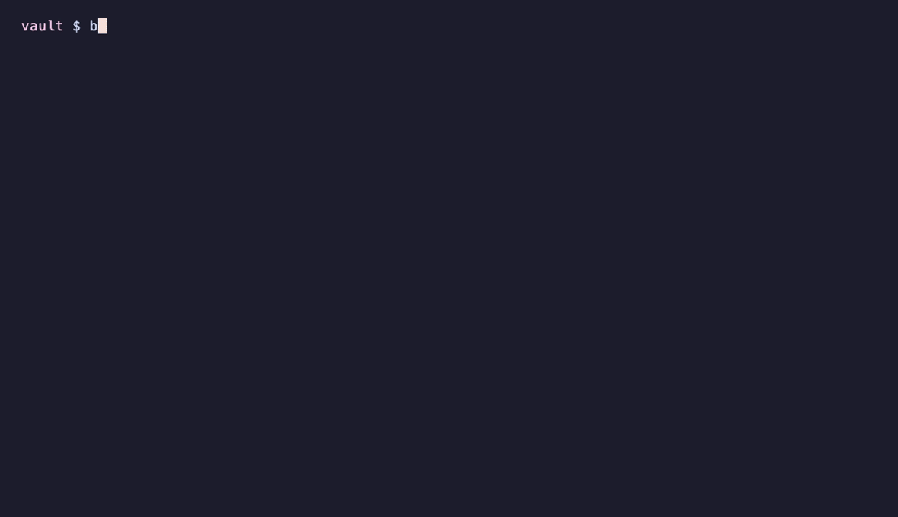

# backlinker

**Type one line in your terminal. It lands in today's Obsidian daily note with `[[links]]` to the people, companies and topics already in your vault.**

```console
$ bl "coffee with Maya about the Lumen raise, Northwind may lead"
Daily/2026-10-07.md
  - 14:32 coffee with [[Maya Chen|Maya]] about the [[Lumen Labs|Lumen]] raise, [[Northwind Capital|Northwind]] may lead
✓ linked Maya Chen, Lumen Labs, Northwind Capital
```

Because the line links those notes, it shows up in each note's **backlinks**: open Maya's note next month and the coffee is there. You never have to open Obsidian, find the right note or type a bracket.



- **Works with your vault as it is.** It reads Obsidian's own vault list and your Daily notes settings (folder, date format, template), so there's nothing to configure.
- **Links you can trust.** It only links whole words, never guesses between two notes with the same name, and tells you when it skipped one.
- **Private.** No network, no AI, no account. Nothing leaves your vault, and the CLI has no dependencies beyond Python.
- **Safe.** Every change is one `bl undo` away, and it will never overwrite a note that changed under it.

Also included: tasks with due dates, filing into a specific note, retro-linking old notes, an inbox you can fill from your phone, an MCP server so Claude can file notes for you, and an Obsidian plugin.

## Quickstart

```bash
pipx install backlinker       # or: pip install backlinker   (Python 3.11+)
bl init                       # picks your vault from Obsidian's vault list
bl -n "first note with Maya"  # -n: show the change, write nothing
bl "first note with Maya"
```

`bl` and `backlinker` are the same command.

## What you can do

| You type | What happens |
|---|---|
| `bl "call with Priya re the pilot"` | A line in today's daily note, with mentions linked |
| `bl -t "send Jonas the deck fri"` | `- [ ] send [[Jonas Weber\|Jonas]] the deck 📅 2026-10-09` |
| `bl --to Jonas "wants a weekly update"` | Also adds `- [[2026-10-07]] wants a weekly update` under `## Notes` in Jonas's note |
| `bl --date yesterday "ran 5k"` | Goes into yesterday's note instead |
| `echo "..." \| bl -` | Reads stdin, one entry per line |
| `bl link "Meeting notes"` | Links every unlinked mention in an existing note (`-n` to preview) |
| `bl triage` | Walks through your `Inbox.md` and files each line |
| `bl undo` | Takes back the last change, across every file it touched |
| `bl --json ...` | Machine-readable output for scripts, Raycast, Alfred, Shortcuts |

### How linking works

backlinker indexes every note's file name and its `aliases` frontmatter. It then reads your text one word at a time, always trying the longest name first:

- **Whole words only.** "Lumens" doesn't link to Lumen, and "said" never matches a note called "AI".
- **Short names match exact case.** Names of 3 letters or fewer must match exactly, so `MM` links but `mm` doesn't.
- **First names work for people.** A person is a note in a `People` folder or tagged `#person`. "Maya" links to Maya Chen if she's the only Maya and you capitalised it.
- **Ambiguous names are left alone.** With two Sams, `Sam` stays plain text and you're told: `? 'Sam' could be Sam Okafor or Sam Patel`. Add `Sam` as an alias on the right note and it links from then on.
- **Some text is never touched:** existing links, `code`, URLs, emails, `#tags` and `$maths$`.
- **Each note is linked once per line** (the first mention), and links read naturally: `[[Maya Chen|Maya]]`, `[[Maya Chen|Maya]]'s deck`.

When two notes share a file name, the link uses the path (`[[Projects/Harbor]]`), so it always points at the right one.

### Tasks and due dates

`-t` (or starting the line with `todo:` or `[ ]`) makes a task. A date phrase in it becomes a [Tasks](https://publish.obsidian.md/tasks/) due date (or Dataview `[due:: ]`, see configuration):

| Phrase (today is Wed 7 Oct) | Due |
|---|---|
| `today`, `tomorrow`, `tmrw` | 7 Oct, 8 Oct |
| `fri`, `on fri`, `friday`, `this fri` | 9 Oct (the coming one, never today) |
| `next fri` | 16 Oct (Friday of next week) |
| `next week` | Mon 12 Oct |
| `in 3 days`, `in two weeks` | 10 Oct, 21 Oct |
| `oct 9`, `9th of october`, `2026-10-09` | 9 Oct (the next one, so `sep 30` means next year) |

Numeric dates like `10/9` are deliberately not read, because they could be 9 October or 10 September. Short day names (`sat`, `sun`, `wed`) only count after `on`/`by`/`due`/`next` or at the end of the line, so "I sat with Paul" isn't a task due Saturday.

### Inbox triage: capture from your phone

Jot lines into `Inbox.md` from anywhere: Obsidian mobile, Drafts, an Apple Shortcut that appends to the file. Back at your computer:

```console
$ bl triage
3 line(s) in Inbox.md.  [enter] file  [t] task  [n] into a note  [s] skip  [d] delete  [q] quit

[1/3] Jonas thinks Northwind will lead the round
   → Daily/2026-10-06.md: - 18:40 [[Jonas Weber|Jonas]] thinks [[Northwind Capital|Northwind]] will lead the round
   >
```

A line starting with a date (`2026-10-06 18:40 …`, which Shortcuts can add for you) goes to that day's note at that time. Each line leaves the inbox in the same undo step that files it, and only once it has been written to its new note. `bl triage --all` files everything without asking.

## Obsidian plugin

The same linker runs inside Obsidian, on desktop and **mobile**:

- **Capture to daily note** (command, ribbon icon): type a line, see the links as you type, and press Enter.
- **Link mentions in selection or note**: retro-links an existing note. Ctrl/Cmd+Z undoes it.

Plenty of plugins already link note titles as you type. This one is for capture with the exact rules of the CLI: the same golden test cases ([spec/linker-cases.json](spec/linker-cases.json)) run against both, so a line links the same whether you type it in a terminal, on your phone or through Claude.

Until it's in the community store, install it from the [latest release](https://github.com/owen-alderson/backlinker/releases): put `main.js`, `manifest.json` and `styles.css` in `<vault>/.obsidian/plugins/backlinker/` and enable it under *Community plugins*.

## Use it from Claude (MCP)

```bash
pipx install 'backlinker[mcp]'          # or: pipx inject backlinker mcp
claude mcp add backlinker -- bl mcp     # Claude Code; any MCP client can run `bl mcp`
```

Tools: `capture` (with `task`, `day`, `to`, `dry_run`), `preview_links`, `find_note`, `undo_last`. Ask Claude to "log that I agreed the pricing with Maya" and it lands in your daily note, linked, using the same rules as everything else.

## Configuration

`bl config` shows your settings and `bl config KEY VALUE` changes one. They're stored per vault in `~/.config/backlinker/config.toml`.

| Key | Default | |
|---|---|---|
| `heading` | *(end of note)* | Add captures under this heading, e.g. `"## Log"`; it's created if missing |
| `time_prefix` | `true` | `- 14:32 …` for today's entries |
| `notes_heading` | `"## Notes"` | Where `--to` adds its line |
| `inbox` | `"Inbox.md"` | The note `bl triage` empties |
| `due_format` | `tasks` | `tasks` (📅 2026-10-09) or `dataview` ([due:: 2026-10-09]) |
| `people_folders` | `People` | Notes here also link by unique first name (as do notes tagged `#person`) |
| `exclude` | | Folders never linked to |
| `ignore` | | Names never linked (e.g. a note called `Home`) |

The vault comes from `--vault NAME_OR_PATH`, then `$BACKLINKER_VAULT`, then `bl init`'s choice, then the vault Obsidian has open. If you use [Periodic Notes](https://github.com/liamcain/obsidian-periodic-notes), its daily settings win over the core plugin's, as they do in Obsidian.

## Safety

- **No partial writes.** Each write goes to a hidden temp file in the same folder and is swapped in atomically. A crash never leaves half a note.
- **No overwriting other edits.** If a note changes between reading it and writing it (you editing it, Obsidian, sync), the write is refused and nothing is lost.
- **Line endings and encoding are kept** (CRLF stays CRLF).
- **Undo is precise.** `bl undo` restores each file exactly. If you've edited a file since, it removes only the block it added, and refuses if that block was changed.

## Development

```bash
python3 -m venv .venv && .venv/bin/pip install -e ".[dev]"
.venv/bin/pytest                      # ~250 tests, no network, temporary vaults only
cd plugin && npm ci && npm test && npm run build
```

- `backlinker/linker.py` and `plugin/src/linker.ts` both run [spec/linker-cases.json](spec/linker-cases.json). The date parsers share [spec/date-cases.json](spec/date-cases.json).
- `spec/moment-cases.json` comes from moment.js itself (`npm run moment-cases`), so the Python daily-note formatter is checked against what Obsidian really uses.
- `docs/demo.gif` is recorded from [docs/demo.tape](docs/demo.tape) with [vhs](https://github.com/charmbracelet/vhs), using the fictional vault in `examples/demo-vault`.
- **Releases.** Push `vX.Y.Z` to publish the CLI to PyPI (Trusted Publishing). Push a bare `X.Y.Z` that matches `manifest.json` to release the plugin.

This project started as `obsidian-quick-add`, a 2-file script; that version is kept at tag [`v1-cli`](https://github.com/owen-alderson/backlinker/tree/v1-cli).

## License

MIT
